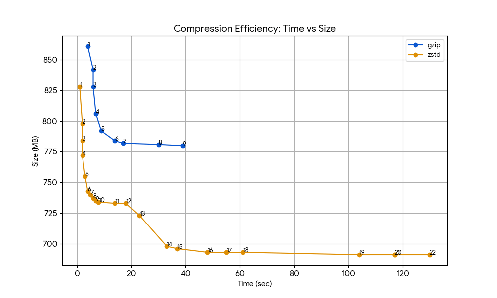

# CondaTainer

Use [apptainer](https://apptainer.org)/[conda](https://anaconda.org)/[squashFS](https://github.com/plougher/squashfs-tools) to manage tools for HPC users.

On HPC, conda is not a good solution, because HPC file system is designed for large files, but conda creates many small files.

This app uses [micromamba](https://mamba.readthedocs.io/en/latest/user_guide/micromamba.html) to create a conda environment within an overlay which can be mounted to apptainer/singularity container.

Then we can stack multiple overlays to create different environments.

```bash
condatainer exec \
  -o trim-galore=0.6.10 \
  -o cutadapt=5.2 \
  -o fastqc=0.12.1 \
  bash -c "fastqc --version && cutadapt --version && trim-galore --version"

# Will equivalently run:
apptainer exec \
  --env PATH="/opt/fastqc/0.12.1/bin:/opt/cutadapt/5.2/bin:/opt/trim-galore/0.6.10/bin:/usr/sbin:/usr/bin" \
  -o /path/to/trim-galore--0.6.10.sqf:ro \
  -o /path/to/cutadapt--5.2.sqf:ro \
  -o /path/to/fastqc--0.12.1.sqf:ro \
  /path/to/base_image.sif \
  bash -c "fastqc --version && cutadapt --version && trim-galore --version"
```

## CondaTainer command

```bash
# Will create trim-galore, cutadapt, fastqc overlays
condatainer create trim-galore=0.6.10 cutadapt=5.2 fastqc=0.12.1
condatainer create grch38=salmon-1.10.3=gencode44 # create genome index overlay
# Will create one overlay with all packages
condatainer create -n sci-rna-seq trim-galore=0.6.10 star=2.7.11b ...
condatainer create -n sci-rna-seq -f sci-rna-seq-packages.yml
condatainer create -p ./sci_rna -f sci-rna-seq-packages.yml # p = prefix

condatainer avail # check available local build scripts (please use grep to filter)
condatainer list  # list created overlays

# Run command with specified overlays
condatainer exec -o trim-galore=0.6.10 -o cutadapt=5.2 -o fastqc=0.12.1 command

condatainer check script.sh # check if all required overlays are installed
condatainer check script.sh --auto-install # auto install missing overlays

condatainer run script.sh # run script with required overlays
```

### script example

My script will try to use `#DEP:` comments to get required overlays.

```bash
#!/bin/bash
#DEP:trim-galore/0.6.10
#DEP:cutadapt/5.2
```

- When runing `condatainer check script.sh`, check if all required overlays are installed.
- When runing `condatainer run script.sh`, auto load required overlays.
- Ambiguous versions is not allowed, e.g., `#DEP:trim-galore` will raise error.

## Apptainer Requirements

[Apptainer repo](https://github.com/apptainer/apptainer)

```bash
sudo apt install uidmap squashfuse gocryptfs fuse-overlayfs
```

## MEMO

- Use `zstd` compression level 14 for best speed/size tradeoff for squashfs overlays. 
  - (You can also use `--lz4` for faster reading speed, but much larger file size)
- [Compression Method Benchmarks](https://github.com/inikep/lzbench)
- zstd has better compression ratio and reading speed than gzip.

I used cellranger 9.0.1 to benchmark various compression methods for squashfs.

- gzip 1-9 and zstd 1-22 were tested.
- folder size (2.4 GB)
- the results can be found in [squash_bench.csv](assets/squash_bench.csv)


